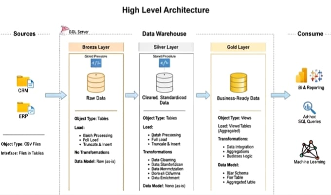

📊 Data Warehouse & Analytics Project

A modern SQL Server Data Warehouse project using SQL to transform raw ERP and CRM data into meaningful business insights.

The project follows the Medallion Architecture, consisting of three layers:

- 🥉 Bronze: Raw source data
- 🥈 Silver: Cleaned and validated data
- 🥇 Gold: Business-ready Star Schema

---

📌 Objectives

- Build a scalable SQL Server Data Warehouse
- Develop Bronze, Silver, and Gold layers
- Implement ETL processes
- Clean and integrate ERP and CRM data
- Create fact and dimension tables
- Perform data quality checks
- Generate analytical insights
- Prepare business-ready data for analysis

---

🔄 ETL Process

ERP & CRM CSV Files
        ↓
     Bronze
        ↓
     Silver
        ↓
      Gold
        ↓
 SQL Analytics

ETL Workflow

1. Extract – Collect raw ERP and CRM CSV files
2. Load – Store the raw data in the Bronze layer
3. Transform – Clean, standardize, and validate data in the Silver layer
4. Model – Create business-ready fact and dimension tables in the Gold layer
5. Analyze – Generate business insights using SQL

---

⭐ Data Modeling

The Gold layer follows a Star Schema designed for efficient analytical queries and reporting.

📊 Fact Table

- "gold.fact_sales" – Stores sales transactions, including customers, products, dates, quantities, sales amounts, and other measures used for analysis.

📐 Dimension Tables

- "gold.dim_customers" – Stores customer information and attributes
- "gold.dim_products" – Stores product information and attributes
- "gold.dim_date" – Stores calendar and date-related attributes

---

📈 Analytics

The data warehouse supports various analytical use cases, including:

- Customer purchasing analysis
- Product revenue analysis
- Product profitability analysis
- Sales trends and performance analysis
- Customer performance analysis
- Product performance analysis
- KPI calculation
- Business performance reporting
- Analytical SQL queries

---

🧪 Data Quality

Data quality checks are performed throughout the data warehouse to ensure reliable and consistent data.

Key checks include:

- NULL value detection
- Duplicate record detection
- Primary key validation
- Foreign key validation
- Date validation
- Numeric and value validation
- Source-to-target record count validation
- Business rule validation
- Data consistency checks

---

🛠️ Technologies

Technology| Purpose
SQL Server| Data Warehouse
SQL| Data Transformation and Analytics
CSV / Excel| Source Data
Draw.io| Data Architecture and Data Modeling
GitHub| Version Control and Project Documentation

---

📂 Repository Structure

data-warehouse-project/
│
├── datasets/
│
├── docs/
│
├── scripts/
│   ├── bronze/
│   ├── silver/
│   └── gold/
│
├── tests/
│
├── README.md
│
└── LICENSE

---

📚 Documentation

The project documentation covers:

- Data Architecture
- Medallion Architecture
- ETL Process
- Data Flow
- Data Modeling
- Data Catalog
- Data Quality Checks
- Analytical SQL Queries

---

🚀 Key Learning Outcomes

Through this project, I gained practical experience in:

- SQL Server and Data Warehousing
- Medallion Architecture
- ETL and Data Integration
- Data Cleaning and Transformation
- Star Schema Data Modeling
- Fact and Dimension Tables
- Data Quality Testing
- SQL Analytics
- GitHub Project Management

---

👩‍💻 About Me

Hi, I'm Vidhya S 👋

I am an Aspiring Data Analyst with an interest in SQL and data analytics. I enjoy working with data, transforming raw datasets into meaningful information, and generating insights that support better business decisions.

---

🎯 Career Goal

My goal is to build a career as a Data Analyst / BI Professional and use data to solve real-world business problems through data analysis, SQL, and data-driven decision-making.

---

📫 Let's Connect

I am open to learning, collaboration, and data-related opportunities.

---

---

⭐ If you find this project useful, feel free to explore the repository and give it a star!
